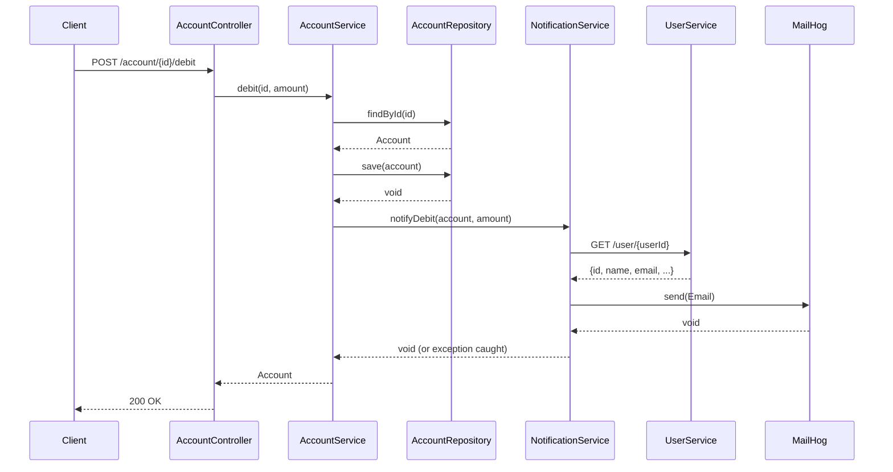

# Design Document: Email Notifications

## Overview

This feature adds fire-and-forget transactional email notifications to the Fund Transfer System. After every successful `debit()` or `credit()` operation in `account-service`, the system fetches the account owner's email from `user-service` via HTTP and sends a notification email through MailHog (Symfony Mailer over SMTP).

The design is intentionally minimal: a single new `NotificationService` class is introduced, wired into the existing `AccountService` via nullable constructor injection. No new HTTP endpoints, no new database tables, and no message queue are required.

---

## Architecture



Key architectural decisions:

- **Fire-and-forget**: `AccountService` wraps the `NotificationService` call in a try/catch. Any exception is logged and swallowed; the updated `Account` is always returned.
- **Nullable injection**: `NotificationService` is injected as `?NotificationService` so existing tests that construct `AccountService` without it continue to work without modification.
- **No interface for NotificationService**: Since there is only one implementation and it is not a data-access concern, a concrete class is sufficient. The existing coding standards require interfaces for repositories; services that are not data-access layers do not require one.
- **Symfony Mailer + HttpClient**: Both are standard Symfony components already present in the shared lib or easily added. No third-party mailer abstraction is needed.

---

## Components and Interfaces

### New: `NotificationService`

```
App\Service\NotificationService
```

**Constructor dependencies:**
- `Symfony\Contracts\HttpClient\HttpClientInterface` — to call `user-service`
- `Symfony\Component\Mailer\MailerInterface` — to send emails
- `Psr\Log\LoggerInterface` — to log errors (injected via Symfony's autowiring)

**Public methods:**

| Method | Signature | Description |
|---|---|---|
| `notifyDebit` | `notifyDebit(Account $account, string $amount): void` | Fetches user email, sends "Account Debited" email. Catches all exceptions internally. |
| `notifyCredit` | `notifyCredit(Account $account, string $amount): void` | Fetches user email, sends "Account Credited" email. Catches all exceptions internally. |

**Private helpers:**

| Method | Signature | Description |
|---|---|---|
| `fetchUserEmail` | `fetchUserEmail(int $userId): ?string` | Calls `GET http://user-service/user/{userId}`, returns email string or null on any failure. |
| `sendEmail` | `sendEmail(string $to, string $subject, string $body): void` | Constructs and sends a `Symfony\Component\Mime\Email`. Catches mailer exceptions internally. |

### Modified: `AccountService`

The constructor gains an optional third parameter:

```php
public function __construct(
    AccountRepositoryInterface $accountRepository,
    AccountFactory $accountFactory,
    ?NotificationService $notificationService = null
)
```

`debit()` and `credit()` are updated to call the notification after a successful `save()`:

```php
// After save():
try {
    $this->notificationService?->notifyDebit($account, $amount);
} catch (\Throwable $e) {
    $this->logger->error('Notification failed: ' . $e->getMessage());
}
```

`AccountService` also gains a `LoggerInterface` dependency for logging notification failures.

---

## Data Models

No new database tables or entities are introduced.

### User API Response (from `user-service`)

```json
{
  "id": 1,
  "name": "Alice",
  "email": "alice@example.com",
  "createdAt": "2024-01-01T00:00:00+00:00"
}
```

Only the `email` field is consumed by `NotificationService`.

### Email Message Structure

| Field | Debit value | Credit value |
|---|---|---|
| From | `noreply@fund-transfer.local` | `noreply@fund-transfer.local` |
| To | fetched from user-service | fetched from user-service |
| Subject | `Account Debited` | `Account Credited` |
| Body | Plain text including amount and new balance | Plain text including amount and new balance |

Example debit body:
```
Your account has been debited.
Amount: 200.00
New balance: 800.00
```

Example credit body:
```
Your account has been credited.
Amount: 500.00
New balance: 1500.00
```

---

## Correctness Properties

*A property is a characteristic or behavior that should hold true across all valid executions of a system — essentially, a formal statement about what the system should do. Properties serve as the bridge between human-readable specifications and machine-verifiable correctness guarantees.*

### Property 1: Notification recipient matches user-service email

*For any* account with any `userId`, when `notifyDebit()` or `notifyCredit()` is called and `user-service` returns a valid email for that `userId`, the email sent via `MailerInterface` SHALL have that exact email address as the recipient.

**Validates: Requirements 3.1, 3.2, 4.1, 5.1**

### Property 2: Debit email body contains amount and balance

*For any* debit amount string and new balance string, the body of the email sent by `notifyDebit()` SHALL contain both the amount and the new balance as substrings.

**Validates: Requirements 4.4, 4.5**

### Property 3: Credit email body contains amount and balance

*For any* credit amount string and new balance string, the body of the email sent by `notifyCredit()` SHALL contain both the amount and the new balance as substrings.

**Validates: Requirements 5.4, 5.5**

### Property 4: Non-200 user-service response suppresses email send

*For any* non-200 HTTP status code returned by `user-service`, `notifyDebit()` and `notifyCredit()` SHALL NOT call `MailerInterface::send()` and SHALL NOT throw an exception.

**Validates: Requirements 3.3**

### Property 5: AccountService notification failure does not propagate

*For any* exception type thrown by `NotificationService`, `AccountService::debit()` and `AccountService::credit()` SHALL return the updated `Account` entity without re-throwing the exception.

**Validates: Requirements 6.1, 6.2**

### Property 6: AccountService calls correct notification method with correct arguments

*For any* account and amount, after a successful `debit()`, `AccountService` SHALL call `notifyDebit()` with the post-debit `Account` and the original amount string; after a successful `credit()`, it SHALL call `notifyCredit()` with the post-credit `Account` and the original amount string.

**Validates: Requirements 7.3, 7.4**

---

## Error Handling

| Failure scenario | Handling |
|---|---|
| `user-service` returns non-200 | `fetchUserEmail()` logs error, returns `null`; `notifyDebit/Credit()` returns early |
| `user-service` network timeout / exception | Same as above — caught in `fetchUserEmail()` |
| Response JSON missing `email` field | `fetchUserEmail()` logs error, returns `null`; caller returns early |
| `MailerInterface::send()` throws | Caught inside `sendEmail()`; logged; no re-throw |
| Any uncaught exception from `NotificationService` | Caught in `AccountService`; logged via `LoggerInterface`; updated `Account` returned normally |
| `NotificationService` is `null` | PHP nullsafe operator `?->` skips the call entirely |

---

## Testing Strategy

### Unit Tests (PHPUnit)

All unit tests use mocked dependencies — no real HTTP calls or SMTP connections.

**`NotificationServiceTest`** covers:

- Happy path debit: `HttpClientInterface` returns valid user JSON → `MailerInterface::send()` called with correct subject, from, to, and body containing amount and balance.
- Happy path credit: same as above with `Account Credited` subject.
- Non-200 from user-service: `MailerInterface::send()` is never called; no exception thrown.
- Network exception from `HttpClientInterface`: `MailerInterface::send()` is never called; no exception thrown.
- Missing `email` field in response: `MailerInterface::send()` is never called; no exception thrown.
- `MailerInterface::send()` throws: exception is caught; no exception propagates.

**`AccountServiceTest`** additions cover:

- `debit()` calls `notifyDebit()` after `save()` with correct arguments.
- `credit()` calls `notifyCredit()` after `save()` with correct arguments.
- `debit()` with `NotificationService` throwing: updated `Account` is still returned.
- `credit()` with `NotificationService` throwing: updated `Account` is still returned.
- `debit()` with `null` `NotificationService`: completes without error.
- `credit()` with `null` `NotificationService`: completes without error.

### Property-Based Testing

This feature is a good candidate for property-based testing for the body-content and error-isolation properties. The recommended library for PHP is [**eris**](https://github.com/giorgiosironi/eris) or [**phpcheck**](https://github.com/igorw/phpcheck). Given the project already uses PHPUnit, **eris** integrates cleanly as a PHPUnit trait.

Each property test runs a minimum of 100 iterations.

Tag format: `Feature: email-notifications, Property {N}: {property_text}`

| Property | Test class | What varies |
|---|---|---|
| Property 1 | `NotificationServiceTest` | `userId`, email string returned by mock |
| Property 2 | `NotificationServiceTest` | amount string, balance string |
| Property 3 | `NotificationServiceTest` | amount string, balance string |
| Property 4 | `NotificationServiceTest` | HTTP status code (400–599) |
| Property 5 | `AccountServiceTest` | exception class/message thrown by NotificationService mock |
| Property 6 | `AccountServiceTest` | account balance, amount string |

### Integration Tests

Not required for this feature. MailHog can be verified manually via its web UI at `http://localhost:8025` after running the Docker stack.
