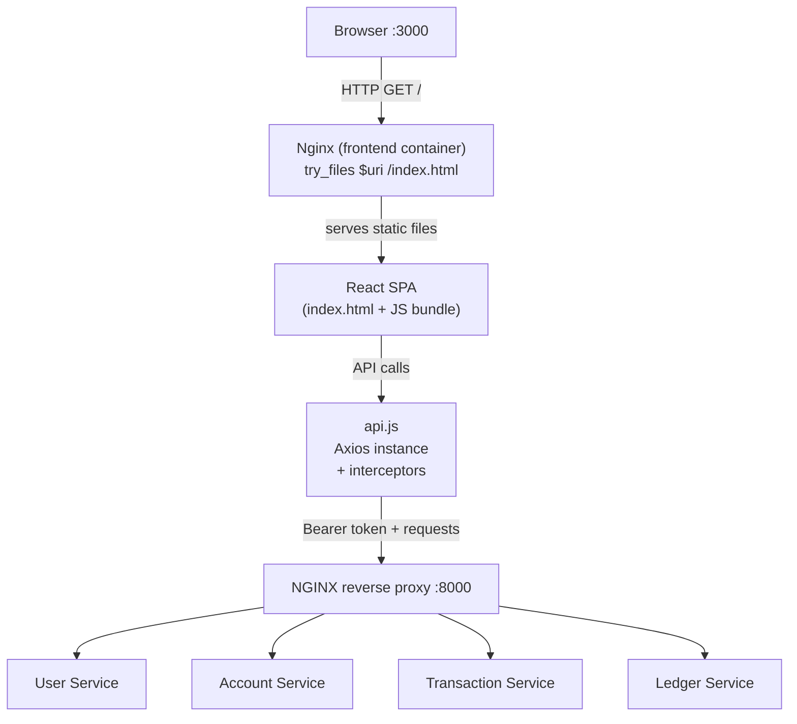
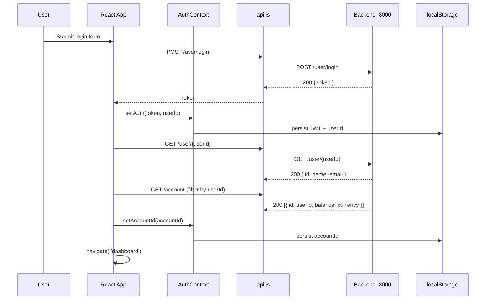
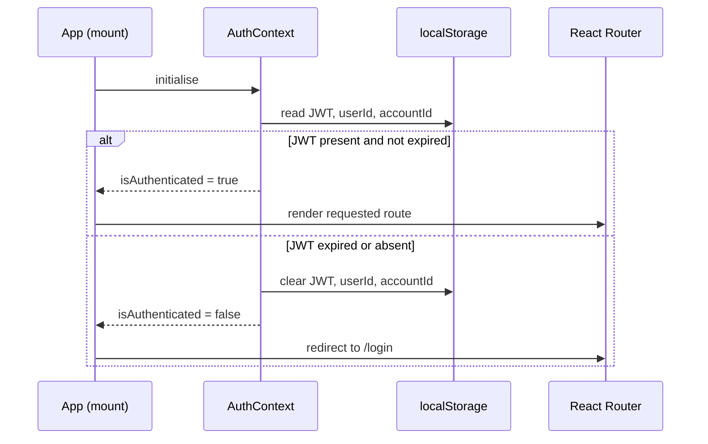

# Design Document — react-frontend

## Overview

The React frontend is a single-page application (SPA) that provides a browser-based UI for the Fund Transfer System. It runs as a Docker service (`frontend`) on port 3000 alongside the existing PHP/Symfony microservices and communicates exclusively with the backend through the NGINX reverse proxy at `http://localhost:8000`.

The app is built with **React 18 + Vite**, styled with **Tailwind CSS**, routed with **React Router v6**, and makes all HTTP calls through a single **Axios**-based API client module. Authentication state (JWT, userId, accountId) is persisted in `localStorage` and managed via the **Context API**.

### Key Design Decisions

| Decision | Choice | Rationale |
|---|---|---|
| Build tooling | Vite | Fast HMR, minimal config, native ESM |
| Routing | React Router v6 | Industry standard, declarative nested routes |
| Auth state | Context API + localStorage | No external state library needed for this scope |
| HTTP client | Axios | Interceptor support for token injection and 401 handling |
| Styling | Tailwind CSS | Utility-first, no component library overhead for MVP |
| Container | Multi-stage Docker (Node → Nginx alpine) | Small production image, static file serving |
| API base | `http://localhost:8000` | Matches existing NGINX reverse proxy |

---

## Architecture



### Auth Flow



### Page Refresh / Session Restore Flow



---

## Components and Interfaces

### Component Tree

```
App
├── AuthProvider (Context)
│   └── Router
│       ├── /login              → LoginPage
│       ├── /register           → RegisterPage
│       └── ProtectedRoute
│           └── Layout (nav + logout)
│               ├── /dashboard          → DashboardPage
│               │   ├── BalanceCard
│               │   ├── LoadingSpinner
│               │   └── ErrorBanner
│               ├── /transactions       → TransactionHistoryPage
│               │   ├── DateRangeFilter
│               │   ├── TransactionTable
│               │   ├── LoadingSpinner
│               │   └── ErrorBanner
│               └── /transfer           → TransferPage
│                   ├── AccountSelector
│                   ├── TransferForm
│                   ├── LoadingSpinner
│                   └── ErrorBanner
```

### Component Interfaces

#### `AuthContext`
```js
{
  token: string | null,
  userId: number | null,
  accountId: number | null,
  isLoading: boolean,          // true while reading localStorage on mount
  isAuthenticated: boolean,
  login(token, userId): Promise<void>,   // stores token, resolves account, sets accountId
  logout(): Promise<void>,               // calls POST /user/logout, clears state
  setAccountId(id): void
}
```

#### `ProtectedRoute`
Wraps any route that requires authentication. Renders `<LoadingSpinner>` while `isLoading` is true, redirects to `/login` if `!isAuthenticated`, otherwise renders `<Outlet>`.

#### `Layout`
Renders a top navigation bar with links to Dashboard, Transactions, Transfer, and a Logout button. Wraps page content via `<Outlet>`.

#### `BalanceCard`
```js
props: { balance: string, currency: string }
```
Displays the formatted account balance.

#### `TransactionTable`
```js
props: { entries: LedgerEntry[] }
```
Renders a table of ledger entries with columns: type, amount, currency, date/time.

#### `DateRangeFilter`
```js
props: { onFilter: (startDate: string | null, endDate: string | null) => void }
```
Renders two date inputs and calls `onFilter` when either changes.

#### `TransferForm`
```js
props: { sourceAccountId: number, onSuccess: (txId: number) => void }
```
Renders amount, currency, and destination selector. Handles submit and validation.

#### `AccountSelector`
```js
props: { users: User[], currentUserId: number, value: number | null, onChange: (accountId: number) => void }
```
Renders a `<select>` of users excluding the current user.

#### `ErrorBanner`
```js
props: { message: string | null, onDismiss: () => void }
```
Displays an error message with a dismiss button. Renders nothing when `message` is null.

#### `LoadingSpinner`
No props. Renders a centered spinner.

---

## Data Models

These mirror the API response shapes from the OpenAPI spec.

```js
// User
{ id: number, name: string, email: string, createdAt: string }

// Account
{ id: number, userId: number, balance: string, currency: string, createdAt: string }

// Transaction
{ id: number, sourceAccountId: number, destinationAccountId: number,
  amount: string, currency: string, status: 'pending'|'completed'|'failed', createdAt: string }

// LedgerEntry
{ id: number, transactionId: number, accountId: number,
  entryType: 'debit'|'credit', amount: string, createdAt: string }
```

### localStorage Schema

```js
{
  "jwt":       "<token string>",
  "userId":    "<number as string>",
  "accountId": "<number as string>"
}
```

### Page-Level Data Flows

**DashboardPage**
1. Mount → `GET /account/{accountId}` (accountId from AuthContext)
2. On 200 → render `<BalanceCard balance currency />`
3. On 401 → `logout()` → redirect `/login`
4. On 404 → show "No account found for your user."

**TransactionHistoryPage**
1. Mount → `GET /ledger/account/{accountId}`
2. On 200 → store all entries in state; display 10 most recent (sorted by `createdAt` desc) by default
3. DateRangeFilter change → filter entries client-side; when both dates set, show all matching entries
4. On 401 → `logout()` → redirect `/login`
5. Empty array → show "No transactions found."

**TransferPage**
1. Mount → `GET /user` to populate `AccountSelector`
2. Filter out current user from list
3. Submit → validate → `POST /transaction { sourceAccountId, destinationAccountId, amount, currency }`
4. On 201 → show success message with transaction ID, reset form
5. On 400 → show API error message
6. On 401 → `logout()` → redirect `/login`

---

## File / Folder Structure

```
services/frontend/
├── Dockerfile
├── nginx.conf                  # Nginx SPA config (try_files)
├── index.html                  # Vite entry point
├── vite.config.js
├── tailwind.config.js
├── postcss.config.js
├── package.json
└── src/
    ├── main.jsx                # ReactDOM.createRoot entry
    ├── App.jsx                 # Router + AuthProvider setup
    ├── api.js                  # Axios instance + interceptors
    ├── context/
    │   └── AuthContext.jsx     # AuthProvider + useAuth hook
    ├── components/
    │   ├── ProtectedRoute.jsx
    │   ├── Layout.jsx
    │   ├── BalanceCard.jsx
    │   ├── TransactionTable.jsx
    │   ├── DateRangeFilter.jsx
    │   ├── TransferForm.jsx
    │   ├── AccountSelector.jsx
    │   ├── ErrorBanner.jsx
    │   └── LoadingSpinner.jsx
    └── pages/
        ├── LoginPage.jsx
        ├── RegisterPage.jsx
        ├── DashboardPage.jsx
        ├── TransactionHistoryPage.jsx
        └── TransferPage.jsx
```

---

## Docker + Nginx Configuration Design

### Multi-Stage Dockerfile

```dockerfile
# Stage 1 — build
FROM node:20-alpine AS build
WORKDIR /app
COPY package*.json ./
RUN npm ci
COPY . .
RUN npm run build          # outputs to /app/dist

# Stage 2 — serve
FROM nginx:alpine
COPY --from=build /app/dist /usr/share/nginx/html
COPY nginx.conf /etc/nginx/conf.d/default.conf
EXPOSE 3000
CMD ["nginx", "-g", "daemon off;"]
```

### Nginx SPA Configuration (`nginx.conf`)

```nginx
server {
    listen 3000;

    root /usr/share/nginx/html;
    index index.html;

    location / {
        try_files $uri $uri/ /index.html;
    }

    # Cache static assets
    location ~* \.(js|css|png|jpg|jpeg|gif|ico|svg|woff2?)$ {
        expires 1y;
        add_header Cache-Control "public, immutable";
    }
}
```

The `try_files $uri /index.html` directive ensures that navigating directly to `/dashboard`, `/transactions`, or `/transfer` (or refreshing the page) returns `index.html` so React Router handles the route client-side.

### docker-compose.yml Addition

```yaml
  frontend:
    build:
      context: .
      dockerfile: services/frontend/Dockerfile
    ports:
      - "3000:3000"
    networks:
      - app-network
    depends_on:
      - nginx
```

---

## API Client Design

All API calls go through `src/api.js` — a single Axios instance with two interceptors.

### Instance Configuration

```js
// src/api.js
import axios from 'axios';

const api = axios.create({
  baseURL: 'http://localhost:8000',
  headers: { 'Content-Type': 'application/json' },
});
```

### Request Interceptor — Bearer Token Injection

```js
api.interceptors.request.use((config) => {
  const token = localStorage.getItem('jwt');
  if (token) {
    config.headers.Authorization = `Bearer ${token}`;
  }
  return config;
});
```

### Response Interceptor — 401 and Global Error Handling

```js
api.interceptors.response.use(
  (response) => response,
  (error) => {
    if (error.response?.status === 401) {
      // Clear session and redirect — AuthContext.logout() handles localStorage
      localStorage.removeItem('jwt');
      localStorage.removeItem('userId');
      localStorage.removeItem('accountId');
      window.location.href = '/login';
    }
    return Promise.reject(error);
  }
);

export default api;
```

Pages catch errors from `api.js` calls and map them to user-readable messages:

| Condition | Message |
|---|---|
| `error.response.status === 500` | "Something went wrong. Please try again." |
| `!error.response` (network error) | "Unable to reach the server. Check your connection." |
| `error.response.data.error` present | Use the API-provided message |

All error messages are rendered via `<ErrorBanner>` which is dismissible.

---

## Error Handling

| Scenario | Handling |
|---|---|
| 401 on any request | Interceptor clears localStorage, redirects to `/login` |
| 500 on any request | Page catches, sets error state → `<ErrorBanner>` shows "Something went wrong. Please try again." |
| Network error (no response) | Page catches, sets error state → `<ErrorBanner>` shows "Unable to reach the server. Check your connection." |
| 409 on register | RegisterPage shows "Email already registered." |
| 400 on register/transfer | Page shows `error.response.data.error` |
| 404 on account fetch | DashboardPage shows "No account found for your user." |
| Empty ledger response | TransactionHistoryPage shows "No transactions found." |
| Client-side validation failure | Inline field error, no network request sent |

Error state is local to each page component. `<ErrorBanner>` renders at the top of the page content area and provides a dismiss button that clears the error state.

---


## Correctness Properties

*A property is a characteristic or behavior that should hold true across all valid executions of a system — essentially, a formal statement about what the system should do. Properties serve as the bridge between human-readable specifications and machine-verifiable correctness guarantees.*

Property-based testing is applicable here because the frontend contains pure transformation logic (form validation, data filtering, sorting, rendering), all of which have universal properties that hold across a wide input space. The chosen PBT library is **fast-check** (JavaScript/TypeScript), configured to run a minimum of 100 iterations per property.

Each property test must be tagged with:
`// Feature: react-frontend, Property N: <property_text>`

---

### Property 1: Form submission payload integrity

*For any* valid (name, email, password) triple submitted on the Register form, or any valid (email, password) pair submitted on the Login form, or any valid (destinationAccountId, amount, currency) triple submitted on the Transfer form, the API client should be called with exactly those values in the request body — no fields dropped, no values mutated.

**Validates: Requirements 1.2, 2.2, 8.4**

---

### Property 2: Client-side email validation rejects non-email strings

*For any* string that does not conform to a valid email format (e.g., missing `@`, missing domain), submitting either the Register or Login form should display the validation message "Valid email is required" and make no network request.

**Validates: Requirements 1.8, 2.7**

---

### Property 3: Client-side password length validation

*For any* password string with length strictly less than 6 characters, submitting the Register form should display "Password must be at least 6 characters" and make no network request.

**Validates: Requirements 1.9**

---

### Property 4: API error message passthrough

*For any* error message string returned in the `error` field of a 400 API response body, the affected page (Register or Transfer) should render that exact string to the user — no truncation, no substitution.

**Validates: Requirements 1.5, 8.9**

---

### Property 5: Auth data persistence round-trip

*For any* token string returned by a successful login response, and any accountId resolved from the subsequent account lookup, both values should be retrievable from `localStorage` under the keys `jwt` and `accountId` respectively after the auth flow completes.

**Validates: Requirements 2.3, 6.3**

---

### Property 6: Valid JWT grants protected route access

*For any* non-expired JWT string present in `localStorage`, navigating to any protected route (`/dashboard`, `/transactions`, `/transfer`) should render the protected page content without redirecting to `/login`.

**Validates: Requirements 3.3**

---

### Property 7: Logout sends current JWT as Bearer token

*For any* JWT string stored in `AuthContext`, activating the logout control should result in `POST /user/logout` being called with an `Authorization` header value of `Bearer <that JWT>`.

**Validates: Requirements 4.2**

---

### Property 8: Logout clears session regardless of response status

*For any* HTTP status code returned by `POST /user/logout`, the `jwt`, `userId`, and `accountId` keys should be absent from `localStorage` after the response is received.

**Validates: Requirements 4.3**

---

### Property 9: Dashboard fetches the authenticated user's account

*For any* `accountId` stored in `AuthContext`, mounting `DashboardPage` should trigger a `GET /account/{accountId}` request using that exact ID in the URL path.

**Validates: Requirements 5.1**

---

### Property 10: Balance and currency are rendered from API response

*For any* `(balance, currency)` pair returned in a successful `GET /account/{id}` response, `DashboardPage` should render both the balance value and the currency string visibly on the page.

**Validates: Requirements 5.2**

---

### Property 11: Account resolution uses the authenticated userId

*For any* `userId` stored after a successful login, the app should call `GET /user/{userId}` with that exact ID in the URL path during the account resolution flow.

**Validates: Requirements 6.1**

---

### Property 12: Transaction list shows 10 most recent entries by default

*For any* array of ledger entries with length ≥ 10 and no date filter applied, `TransactionHistoryPage` should display exactly the 10 entries with the most recent `createdAt` timestamps, ordered descending.

**Validates: Requirements 7.2**

---

### Property 13: Transaction entry renders all required fields

*For any* ledger entry object, the rendered table row should contain the `entryType` (debit/credit), `amount`, `currency`, and formatted `createdAt` values.

**Validates: Requirements 7.3**

---

### Property 14: Date range filter correctness and cap removal

*For any* array of ledger entries and any `(startDate, endDate)` range applied via `DateRangeFilter`, the displayed entries should be exactly those whose `createdAt` falls within `[startDate, endDate]` — with no 10-entry cap when both dates are set.

**Validates: Requirements 7.5, 7.6**

---

### Property 15: Current user excluded from transfer destination selector

*For any* list of users returned by `GET /user` and any authenticated `userId`, the `AccountSelector` rendered on `TransferPage` should contain entries for all users except the one whose `id` matches the authenticated `userId`.

**Validates: Requirements 8.2**

---

### Property 16: Transfer amount validation rejects non-positive values

*For any* amount value that is empty, zero, negative, or non-numeric, submitting the Transfer form should display "Enter a valid positive amount" and make no network request.

**Validates: Requirements 8.7**

---

### Property 17: Success message contains the transaction ID

*For any* transaction `id` returned in a `201` response from `POST /transaction`, the success message rendered by `TransferPage` should contain that exact transaction ID.

**Validates: Requirements 8.5**

---

### Property 18: Unknown URL redirects based on auth state

*For any* URL path that does not match a defined route, an authenticated user should be redirected to `/dashboard` and an unauthenticated user should be redirected to `/login`.

**Validates: Requirements 9.4, 9.5**

---

### Property 19: Global error messages are displayed for 500 and network errors

*For any* API call that returns a 500 response, the affected page should display "Something went wrong. Please try again." *For any* API call that results in a network error (no response received), the affected page should display "Unable to reach the server. Check your connection."

**Validates: Requirements 11.1, 11.2**

---

### Property 20: Error banner is always dismissible

*For any* error message displayed by `ErrorBanner`, a dismiss control should be present in the DOM, and activating it should result in the error message no longer being rendered.

**Validates: Requirements 11.4**

---

## Testing Strategy

### Dual Testing Approach

Both unit/example-based tests and property-based tests are used together for comprehensive coverage.

**Unit tests** cover:
- Specific rendering checks (form fields present, nav links present, loading states)
- Specific status-code behaviors (401 redirect, 404 message, 409 message)
- Sequential flow examples (register → auto-login → redirect, logout → clear → redirect)
- Infrastructure configuration assertions (api.js baseURL, Dockerfile structure)

**Property tests** cover:
- All 20 correctness properties above
- Run with **fast-check**, minimum 100 iterations each
- Pure logic is tested in isolation (filtering, sorting, validation, rendering functions)
- Axios calls are mocked with `axios-mock-adapter` or `vi.mock` (Vitest)

### Test Runner

**Vitest** — integrates natively with Vite, supports jsdom, fast execution.

```bash
# single run (CI)
vitest run

# watch mode (dev)
vitest
```

### Test File Locations

```
src/
├── components/
│   ├── __tests__/
│   │   ├── BalanceCard.test.jsx
│   │   ├── TransactionTable.test.jsx
│   │   ├── DateRangeFilter.test.jsx
│   │   ├── TransferForm.test.jsx
│   │   ├── AccountSelector.test.jsx
│   │   ├── ErrorBanner.test.jsx
│   │   └── ProtectedRoute.test.jsx
├── pages/
│   ├── __tests__/
│   │   ├── LoginPage.test.jsx
│   │   ├── RegisterPage.test.jsx
│   │   ├── DashboardPage.test.jsx
│   │   ├── TransactionHistoryPage.test.jsx
│   │   └── TransferPage.test.jsx
├── context/
│   └── __tests__/
│       └── AuthContext.test.jsx
└── __tests__/
    └── api.test.js
```

### Property Test Configuration Example

```js
// Feature: react-frontend, Property 14: Date range filter correctness and cap removal
import fc from 'fast-check';

test('date range filter shows only entries within range', () => {
  fc.assert(
    fc.property(
      fc.array(ledgerEntryArbitrary, { minLength: 0, maxLength: 50 }),
      fc.tuple(fc.date(), fc.date()).map(([a, b]) => [
        a < b ? a : b,
        a < b ? b : a,
      ]),
      ([startDate, endDate], entries) => {
        const filtered = filterByDateRange(entries, startDate, endDate);
        return filtered.every(
          (e) => new Date(e.createdAt) >= startDate && new Date(e.createdAt) <= endDate
        );
      }
    ),
    { numRuns: 100 }
  );
});
```

### Coverage Targets

- All public component props and page data flows: covered by unit tests
- All 20 correctness properties: covered by property tests
- All error/edge cases from requirements: covered by unit tests
- Minimum: every exported function and component has at least one test
